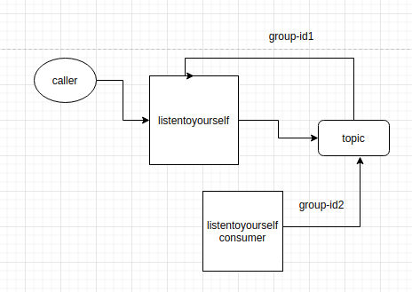

# Architecture Pattern Listen To Your Self

## Technologies

 - Kafka
 - MySql
 

## Introduction

Apparently this pattern arrived to my life in a mysterious way and i decided to implement it. I develop, in the project **listentoyourself**, a producer and a consumer.
When the consumer pick a message from the topic, with a specific group-id, it saves in a database table. Other consumer **listentoyourself-consumer**, with a differente group-id, is 
listening that topic so this consumer can also pick de message and save it in another table.

## Architecture



## Links

[Stop Overusing the Outbox Pattern](https://www.squer.at/en/blog/stop-overusing-the-outbox-pattern/)

[Listen to Yourself: A Design Pattern for Event-Driven Microservices](https://medium.com/@odedia/listen-to-yourself-design-pattern-for-event-driven-microservices-16f97e3ed066)

## DDL and Curl


```
create table ltys_event
(
    id bigint not null primary key,
    name varchar(100) not null
);

create table ltys_otherconsumer_event
(
    id   bigint       not null
        primary key,
    name varchar(100) not null
);
```

```
curl --location --request POST 'http://localhost:8082/api/v1/produce' \
--header 'Content-Type: application/json' \
--data-raw '{
    "id":1,
    "name":"TestedName"
}'
```
